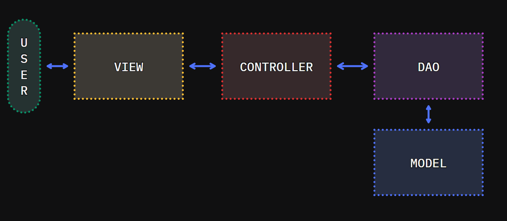
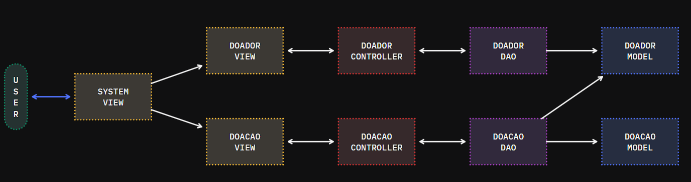

# jvax
Projeto de Programação Orientação à Objetos para um sistema de doação de sangue.

## Arquitetura

A arquitetura deste projeto consiste em uma adaptação do *Model-View-Controller* (MVC). Dessa forma, temos a disposição:

- **Model**: Camada de persistência da aplicação;
- **View**: Camada de visualização e interação com o sistema;
- **Controller**: Camada intermediária que aplica regras de negócio;

Para elucidação, temos as imagens abaixo:

### Arquitetura Ilustrativa

### Arquitetura Prática

## Tecnologias

- Java
- PostgreSQL
